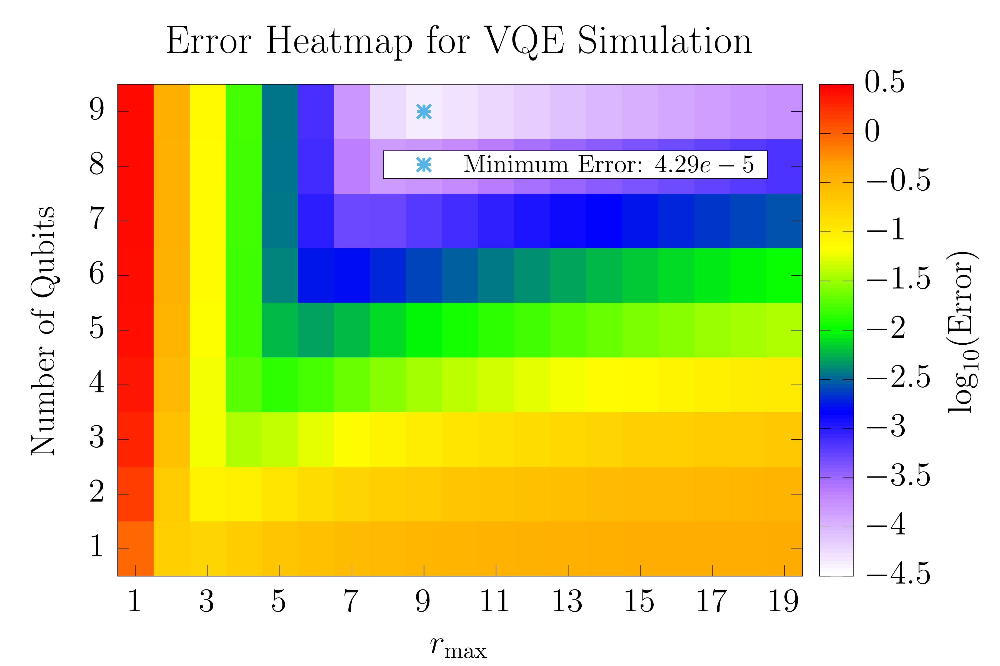
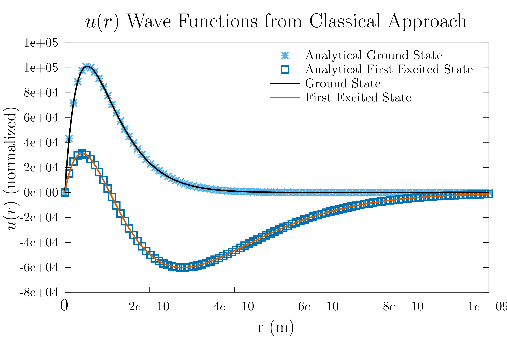

# Overview
This project analyzes the practical limits of Variational Quantum Eigensolvers (VQE) by separating two dominant sources of error:

- **Discretization Error** from finite difference representations of the Hamiltonian
- **Variational Error** from ansatz expressibility and optimization

Rather than evaluating VQE in isolation, it is benchmarked against the best achievable classical solution under identical discretization constraints.

The project evaluates this by computing the ground state energy level of the Hydrogen atom in two different ways:

1. A pure C++ Eigen based eigendecomposition of the Hamiltonian for high resolution, exact decomposition
2. Using qiskit in Python to perform a VQE on the Hamiltonian 

---

## Key Insight

> **In low-qubit regimes, VQE performance is fundamentally constrained by the discretization of the Hamiltonian, not by one's choice of optimizer or ansatz.**
> 
> **This project shows that improving quantum performance requires improving the *problem representation*, not just the quantum algorithm.**

---

## Physical Model 

The analytic Hamiltonian for the radial component of the wavefunction $u(r)=rR(r)$ may be represented as 

$$
 \hat{H}=\left(-\dfrac{\hbar^{2}}{2m_{e}}\dfrac{d^{2}}{dr^{2}} - \dfrac{e^{2}}{4\pi\varepsilon_{0}r} + \dfrac{\hbar^{2}\ell\left(\ell+1\right)}{2m_{e}r^{2}}\right)
$$

in SI units and 

$$
\hat{H}=\left(-\dfrac{1}{2}\dfrac{d^{2}}{dr^{2}} - \dfrac{1}{r} + \dfrac{\ell\left(\ell+1\right)}{2r^{2}}\right)
$$

in atomic units. A brief note that the C++ eigensolver uses SI units, and the python VQE uses atomic units (for consistency in Qiskit implementations). The ground state energy is 

$$
E_{gs}=-13.6 \text{ eV (SI Units)} = -0.5 \text{ Ha (Atomic Units)}.
$$

## Methodology
<!-- While exact diagonalization (C++ approach) scales as O($N^{3}$) where N is the size of the discretized Hamiltonian basis, VQE embeds this problem into exponentially fewer qubits. The number of qubits chosen takes the form $\lceil\log_{2}\left(N_{states}\right)\rceil $. As written the code only accepts exact powers of 2 as the number of states. This can easily be expanded upon by padding the basis to get to the next power of 2. Optimization is performed classically on the expectation value of the Hamiltonian. -->
---
### 1. Finite Difference Discretization 
- Choose grid size $N$
- Choose maximum radial cutoff $r_{\max}$
---
### 2. Classical Baseline (C++)
- Exact diagonalization using Eigen
- Scaling: $O(N^{3})$
- Outputs:
    - First $N$ energies (default: ground state energy) in eV
    - Wavefunctions (default: ground and first excited state)
    - Discretization error observation 
---
### 3. VQE Approximation
- Encodes system using $\lceil\log_{2}\left(N_{states}\right)\rceil$ qubits 
- Ansatz: hardware-efficient SU(2)
- Optimizer: L-BFGS-B
- Simulator: statevector 
- Outputs:
    - Ground state energy (in Ha)
---
### 4. Error Decomposition (Core Result)
We separate total VQE error into 
$$\text{Total Error} = \text{Discretization Error} + \text{Variational Error}$$

Procedure:
- For each $N, r_{max}$:  
    - Compute the *theoretical lower bound* via exact diagonalization under the same discretization
    - Compare VQE output to this lower bound     

This isolates 
- Error due to finite-resolution discretization (numerical precision) 
- Error due to variational uncertainty (quantum algorithm)

---

## Key Results
The quantitative results below should be interpreted relative to the discretization limits identified in the error landscape.
- Classical Solver ($N=1000$)
    - Error: $~0.02\%$
    - Runtime: $~0.3$ seconds
    - Deterministic result 
- VQE (4 qubits, $N=16$)
    - Mean error: $4.13\pm0.95\%$
    - Best error: $3.40\%$
    - Runtime: $13.83\pm7.29$ seconds
    - Best runtime: $5.11$ seconds

Variability in the VQE approach arises from sensitivity to initial parameter choice, as well as the non-convex optimization landscape. In a more expressive ansatz, the barren plateau effect may become more significant due to the expressibility and depth of the ansatz.

### Error Landscape (Main Result)

Results of scanning phase space of number of qubits vs $r_{\max}$ to see the minimum error. Key takeaways:
- Increasing qubits alone does not guarantee better error performance; neither does increasing or decreasing $r_{\max}$
    - Each set ($N_{\text{qubits}}, r_{\max}$) has an optimal solution that balances each error to find the minima
- Discretization error often dominates 
---
### Wavefunction Validation

Classical solutions match analytic hydrogen wavefunctions, validating our choice of discretization. 

---
## Interpretation 
The classical method operates in a large Hilbert space ($N=1000$), while the VQE compresses the system into $\log_{2}\left(N\right)$ qubits. 

- Classical: increasing accuracy $\rightarrow$ higher computational cost 
- VQE - reduced dimensionality $\rightarrow$ increased optimization complexity 

For example: $N=2048$ requires diagonalizing a $2048 \times 2048$ matrix classically, but only 11 qubits under binary encoding.

**Implication**: In low-qubit regimes, improving VQE performance is often a bottleneck on numerical modeling and problem framing, not on the quantum algorithm. 

---

## Engineering Highlights
- Cross-language pipeline: C++ (Eigen) + Python (Qiskit)
- Automated sweeps over $\left(N, r_{\max}\right)$ for error mapping 
- Reproducible plotting via gnuplot + LaTeX 
- Numerical stability near $r\to0$
- End-to-end pipeline via Makefile

## Future Work
Future extensions could incorporate shot-based estimation and noise models to study the robustness of VQE under realistic NISQ hardware constraints.

## How to Run the Code
After installing all dependencies, you can simply run `make` from the main directory of the repository. If you wish to run only the classical approach, run `make classic`. For just the quantum portion: `make quantum`. For just the studying of the phase space of the VQE: `make evaluation`. 

# Repository Layout
```plaintext 
├── quantum/
├── classical/
├── data/
├── Plots/
├── Plotting/
├── Makefile
├── LICENSE
├── requirements.txt
├── README.md
```

- `quantum/`: Directory that performs a VQE in Python and qiskit to solve for the ground state energy of the Hydrogen atom. Contains two files:
    - `vqe.py`: file that handles the VQE solving, as well as creating the Hamiltonian for the VQE
    - `error_estimation.py`: file that benchmarks and evaluates top achievable VQE model performance for varying number of qubits, N and max radius
- `classical/`: Directory that houses C++ code to perform classical eigendecomposition of Hamiltonian to solve for energy levels of Hydrogen atom. This file also outputs the data for the reconstructed wavefunctions of the Hydrogen atom and stores them in `data/wavefunctions.dat`
    - `src/` Houses the source code to run the eigensolver 
    - `include/` Houses the header file to define the eigenSolver class, various constants and other methods
- `data/`: Directory that contains data for output wavefunctions from classical approach
- `Makefile`: Top-level Makefile that, upon running "make", will run all the code and produce the output comparisons
- `Plots/`: Directory that contains output of `error_estimation.py`, including various quantitative evaluations of the VQE project on Hydrogen. As well, output wave functions from the classical approach (done in the `Plotting/` directory)
- `LICENSE`: MIT License for this repo 
- `requirements.txt`: requirements for this repository in python. Can run `pip install -r requirements.txt` for simplicity.
- `Plotting/`: usage of [gnuplot-latex-utils](https://github.com/ksalamone59/gnuplot_latex_utils) as a submodule to create publication-quality plots on the fly through gnuplot and LaTeX. Please see original documentation for more information.
    - `wave_functions/`: Directory that plots the extracted wave functions from the classical approach vs the analytic curves.
    - `pdfs/`: Where the output pdf is stored/

# Requirements 
- Classical:
    - C++ >= C++17
    - CMake
    - Eigen3
- Quantum:
    - numpy
    - matplotlib
    - scipy (scipy.optimize)
    - qiskit
- Dependencies outlined in [gnuplot-latex-utils](https://github.com/ksalamone59/gnuplot_latex_utils) including 
    - Gnuplot 
    - LaTeX